# NEXORA - AI-Enabled Rapid Feed & Silage Quality Testing System

## Overview

NEXORA is an AI-powered decision support platform designed to help dairy farmers assess silage and feed quality rapidly without sending samples to laboratories.

The system combines feed quality parameters, image-based assessment, and intelligent recommendations to provide actionable insights that improve cattle health, milk productivity, and feed management.

---

## Problem Statement

Poor-quality silage can lead to:

* Reduced milk yield
* Nutritional deficiencies
* Animal health issues
* Economic losses for farmers

Traditional testing methods are time-consuming and often inaccessible to small and medium-scale farmers.

---

## Solution

NEXORA enables farmers to:

* Analyze silage quality
* Record feed parameters
* Track feed batches
* Monitor spoilage risk
* Receive feeding recommendations
* Maintain historical records

---

## Current Prototype Features

### Farmer Profile Management

* Farm details
* Herd information
* Breed information
* Milk yield tracking

### Feed Quality Assessment

* pH
* Moisture
* Temperature
* VOC indicators
* NIR inputs

### Quality Analysis

* Feed Quality Score
* Risk Assessment
* Recommendation Engine

### Batch Management

* Sample IDs
* Batch Records
* Historical Tracking

### Smart Features

* Multilingual Support
* Voice Interaction
* QR-based Tracking
* Dashboard Analytics

---

## App Screenshots

### Dashboard

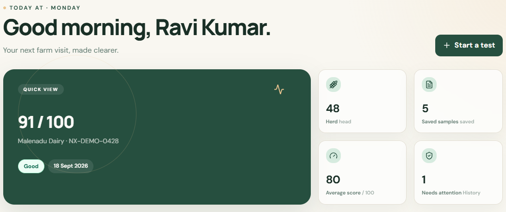

### Feed Quality Readings

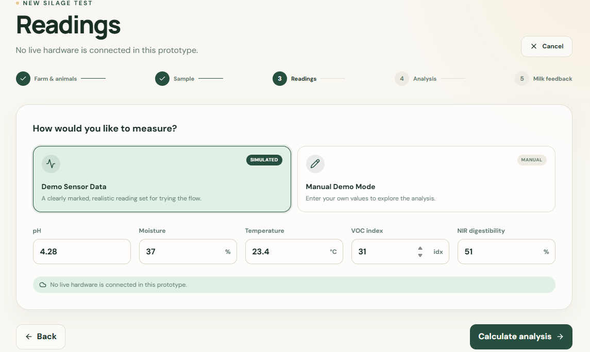

### Quality Analysis

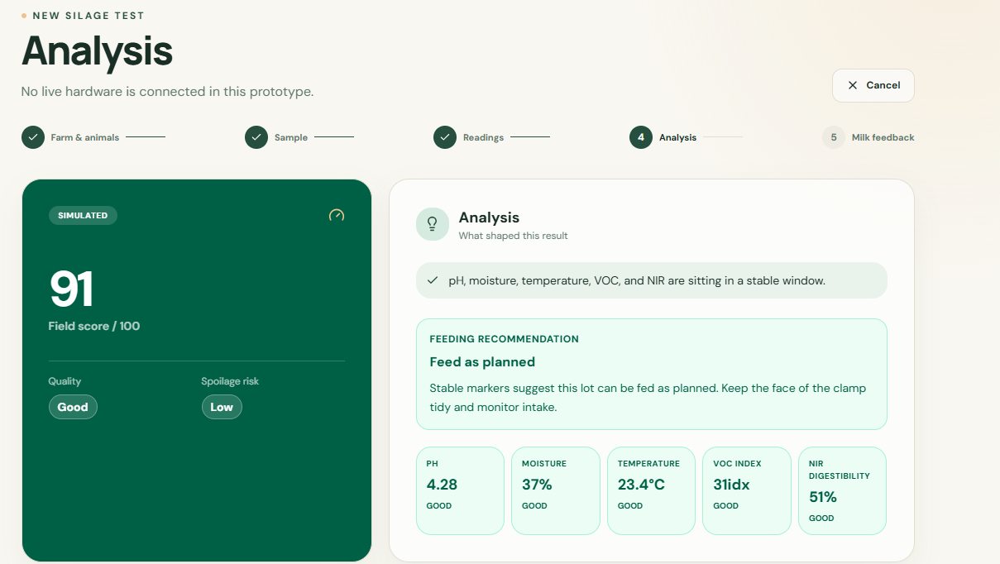

### Sample Photo

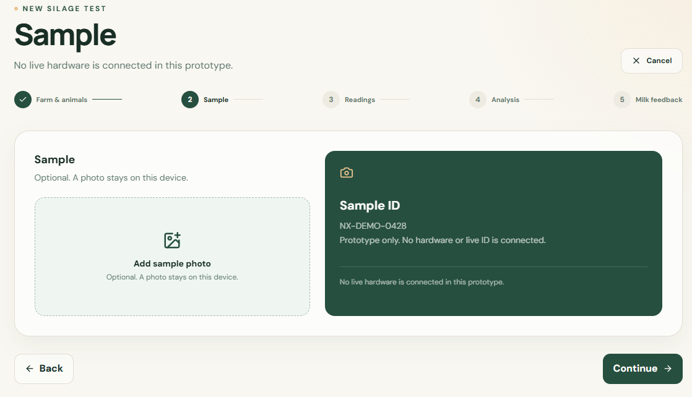

### Feed Recommendations

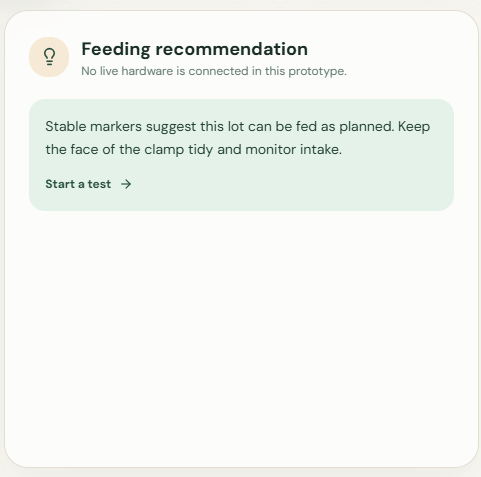

### Recent Tests

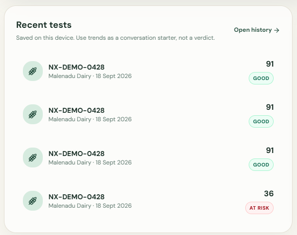

### Test History

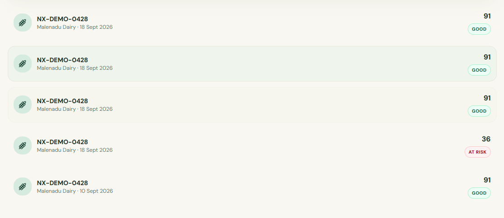

### Test History Graph

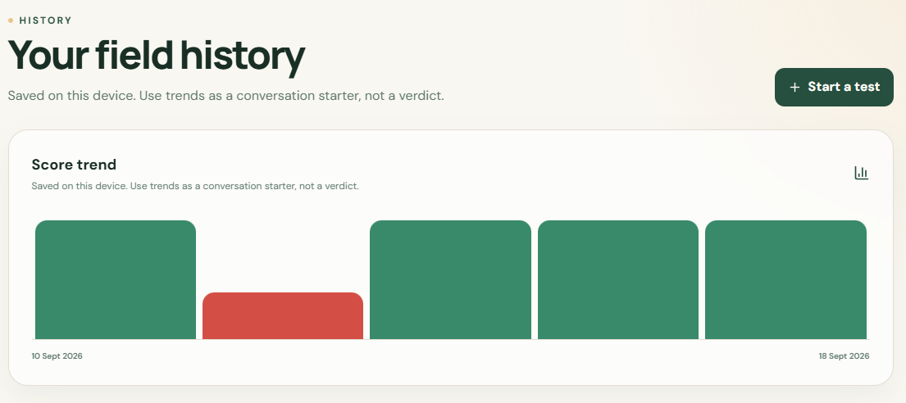

### Farm & Animal Details

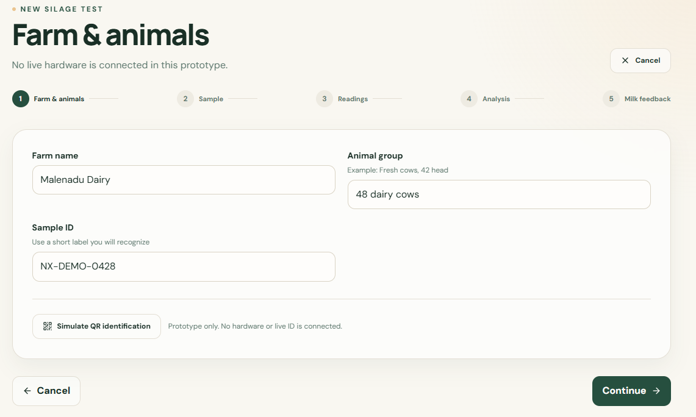

### Your Profile

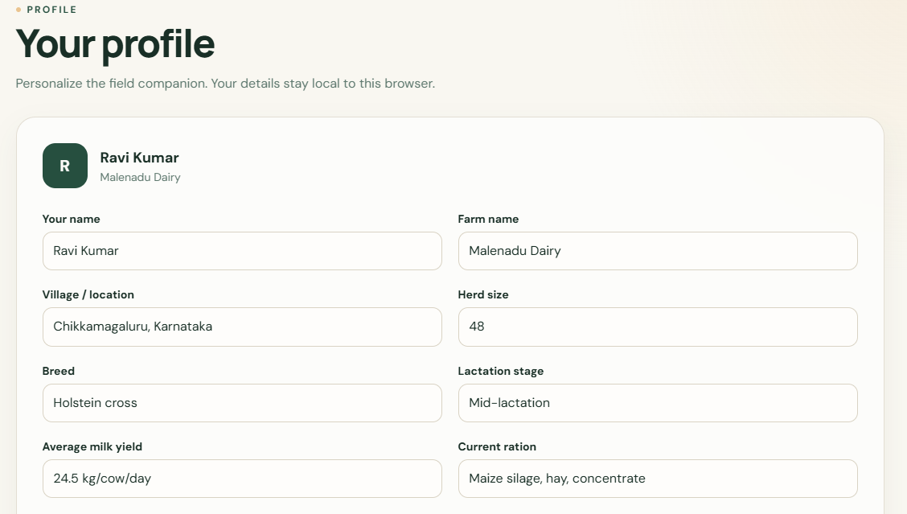

### Language Preference

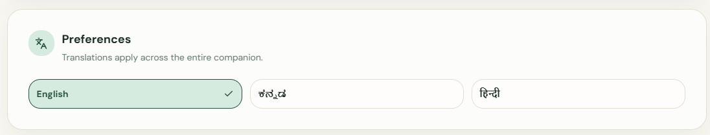

### AI Voice Assistant

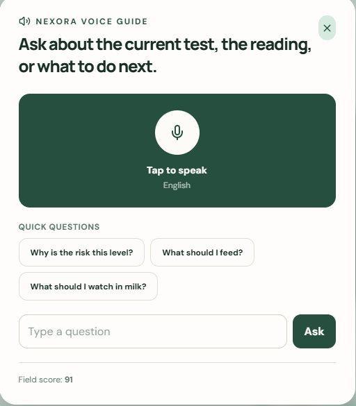

### Feedback

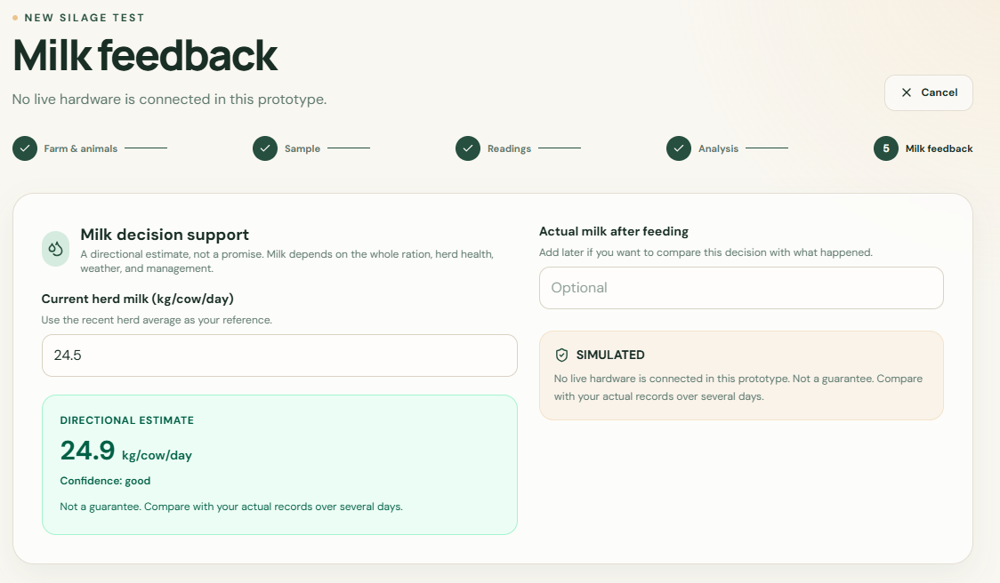

---

## Technology Stack

### Frontend

* React
* TypeScript
* Vite

### Backend

* Node.js
* REST APIs

### Database

* Structured Data Storage

---

## System Workflow

```text
Feed / Silage Sample
        |
Sensors + Camera
        |
Data Collection
        |
AI / ML Analysis
        |
Quality Assessment
        |
Risk & Recommendation
        |
Farmer Dashboard
        |
Historical Record
```

---

## AI & Machine Learning

NEXORA is designed to support AI/ML-based feed and silage quality assessment.

### Image Analysis

* Image preprocessing
* Sample region extraction
* Visual spoilage detection
* Mould and discoloration detection
* Texture variation analysis
* Visible contamination detection

### Sensor & Data Analysis

* Moisture analysis
* Temperature analysis
* pH analysis
* VOC-based indicators
* NIR-based parameters
* Spoilage risk assessment

### Proposed ML Models

* TensorFlow Lite / MobileNetV2 for image-based classification
* Random Forest for sensor and NIR parameter analysis

---

## Future AI Integration

* TensorFlow Lite Image Classification
* OpenCV Image Processing
* Random Forest Prediction Model
* ESP32 Sensor Integration
* Offline Edge Inference
* Deterioration Prediction
* Estimated Safe-use Period

---

## Hardware Integration

The planned hardware system can integrate:

* ESP32 microcontroller
* Camera module
* Moisture sensing
* Temperature sensing
* pH measurement
* VOC / gas sensing
* NIR spectroscopy module
* OLED / LCD display
* QR-based batch identification

The hardware will collect feed and silage parameters and communicate the results to the NEXORA application.

---

## Key Benefits

* Rapid feed and silage quality assessment
* Farmer-friendly interface
* Reduced dependence on laboratory testing
* Feed quality history and batch tracking
* Data-driven feeding recommendations
* Multilingual and voice-based interaction
* Potential for offline edge-based analysis
* Low-cost hardware integration
* Historical farm data management

---

## Future Scope

* Real-time ESP32 sensor integration
* Camera-based visual spoilage detection
* TensorFlow Lite edge inference
* Advanced deterioration prediction
* Estimated safe-use period
* QR-based batch identification
* Offline-first operation
* Integration with cattle health and milk-production data
* Continuous learning through historical farm data
* Improved multilingual voice assistance
* Farm-level analytics and decision support

---

## System Architecture

```text
              NEXORA SYSTEM
                    |
        +-----------+-----------+
        |                       |
   Physical Inputs          Farmer Inputs
        |                       |
  +-----+------+          +-----+------+
  |            |          |            |
Sensors      Camera     Farm Data   Animal Data
  |            |          |            |
  +-----+------+----------+------------+
        |
   Data Processing
        |
   AI / ML Analysis
        |
  +-----+------+
  |            |
Quality      Risk &
Score      Prediction
  |            |
  +-----+------+
        |
Recommendation Engine
        |
   NEXORA Dashboard
        |
  History & Analytics
```

---

## Typical Workflow

1. Farmer collects a feed or silage sample.
2. The system records sensor and image data.
3. NEXORA processes the collected information.
4. AI/ML models analyze quality-related parameters.
5. The system generates a quality assessment.
6. Spoilage and deterioration risks are identified.
7. Feeding recommendations are provided.
8. The test is stored as a batch record.
9. Historical results can be reviewed through the dashboard.

---

## Disclaimer

NEXORA is intended as a decision-support and rapid screening system.

It is not intended to replace laboratory testing, veterinary expertise, animal nutritionists, or professional feed-quality assessment.

---

## Team

**Team NEXORA AI32**

**Smart India Hackathon 2026**
